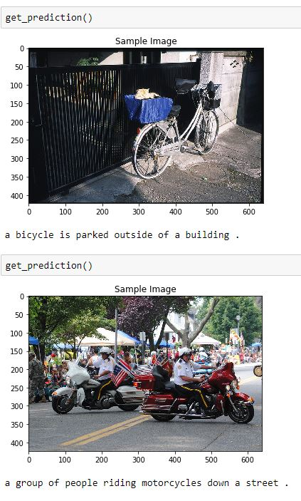

# Automatic Image Captioning 

## Project Overview

Create a deep learning architecture with two components: a CNN to transform the input image into a set of features, an RNN that turns those features into descriptive text aka captions. 

The project is broken up into a few main parts in four Python notebooks

- __0_Dataset.ipynb__ : Loading and Visualizing COCO dataset to train the network. The Microsoft **C**ommon **O**bjects in **CO**ntext (MS COCO) dataset is a large-scale dataset for scene understanding.  The dataset is commonly used to train and benchmark object detection, segmentation, and captioning algorithms.  

  

- __1_Preliminaries.ipynb__ : Design a CNN-RNN model for automatically generating image captions. Implemented a CNN to transform to transform the input image into a set of features and Implemented an RNN decoder using LSTM cells to generate captions. 

  

- __2_Training.ipynb__ : Train the CNN-RNN model. 

- __3_Inference.ipynb__ : Use your trained model to generate captions for images in the test dataset.

## Results
Trained the network around 10 hrs using GPU and achieved average loss of around 2%.

### Some very accurate results from the model

  

### Some not very accurate captions😂😂

  

